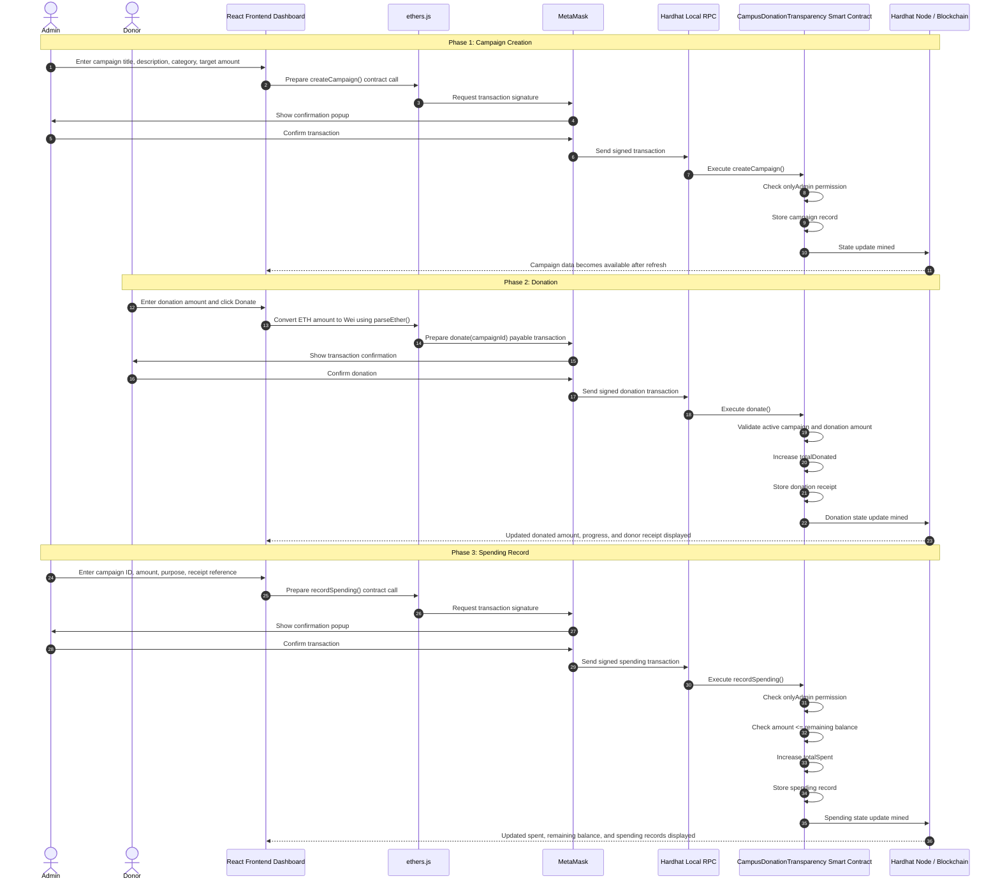

# Campus Donation Transparency App

## 1. Project Overview

Campus Donation Transparency App is a blockchain-based web application designed to improve transparency and trust in campus donation campaigns.

The application allows donors to donate to specific campus causes, such as library renovation, student aid, medical support, and technology support. Every donation and spending record is stored using a Solidity smart contract on a local Hardhat blockchain.

The project includes a React dashboard that displays campaigns, donation progress, milestones, donor receipts, spending records, and remaining balances.

---

## 2. Problem Statement

Traditional campus donation systems usually depend on centralized records controlled by one organization or administrator. This can create several trust issues:

- Donors may not clearly know how their money is used.
- Spending records may not be publicly visible.
- Donation receipts may be stored privately.
- Fund allocation may be unclear.
- Trust depends mainly on the organization instead of verifiable records.

This project solves the problem by using blockchain to make donation and spending records transparent, traceable, and verifiable.

---

## 3. Why Blockchain?

Blockchain is suitable for this project because it provides:

### Transparency

Anyone can view campaigns, total donations, spending records, and remaining balances.

### Traceability

Each donation is linked to a campaign, category, amount, donor address, and timestamp.

### Trust

Records are stored on-chain and cannot be easily changed after being recorded.

### Donor Verification

Donors can connect their wallet and view their own donation receipt history.

### Access Control

Only the admin wallet can create campaigns and record spending.

---

## 4. Main Features

### Campaign Management

The admin can create donation campaigns. Each campaign includes:

- Campaign ID
- Title
- Description
- Category
- Target amount
- Total donated amount
- Total spent amount
- Active status

### Category-Based Donations

Donations are linked to clear campus categories, such as:

- Library
- Student Aid
- Medical Support
- Technology

### Donation Receipts

Every donation is recorded with:

- Donation ID
- Donor wallet address
- Campaign ID
- Category
- Donation amount
- Timestamp

### Spending Records

Only the admin can record spending. Each spending record includes:

- Spending ID
- Campaign ID
- Amount
- Purpose
- Receipt reference
- Timestamp

### Campaign Progress Bar

The frontend displays campaign progress based on the donated amount compared to the target amount.

### Donation Milestones

Each campaign shows four milestones:

- 25%
- 50%
- 75%
- 100%

### Donor View

A donor can connect MetaMask and view their donation receipt history.

### Admin Panel

The admin can:

- Create a new campaign
- Record spending
- View updated campaign balances

### Fund Traceability

The project shows the flow of funds:

```text
Donation received → Category allocation → Spending record → Remaining balance
```

---

## 5. Tech Stack

| Layer | Technology |
|---|---|
| Smart Contract | Solidity |
| Blockchain Development | Hardhat |
| Blockchain Interaction | ethers.js |
| Frontend | React + Vite |
| Wallet | MetaMask |
| Testing | Mocha + Chai |
| Containerization | Docker + Docker Compose |

---

## 6. Project Structure

```text
campus-donation-transparency/
│
├── contracts/
│   └── CampusDonationTransparency.sol
│
├── scripts/
│   └── deploy.ts
│
├── test/
│   └── CampusDonationTransparency.ts
│
├── frontend/
│   ├── Dockerfile
│   ├── .dockerignore
│   ├── package.json
│   └── src/
│       ├── App.jsx
│       ├── App.css
│       ├── main.jsx
│       └── contract.js
│
├── deployments/
│   └── localhost.json
│
├── docker-compose.yml
├── hardhat.config.ts
├── package.json
└── README.md
```

---

## 7. Smart Contract Summary

The main smart contract is:

```text
CampusDonationTransparency.sol
```

The contract handles:

- Campaign creation
- Donation recording
- Donor donation history
- Admin spending records
- Remaining balance calculation
- Campaign progress calculation
- Milestone tracking
- Platform statistics

Important functions:

```text
createCampaign()
donate()
recordSpending()
getAllCampaigns()
getDonorDonations()
getCampaignSpendingRecords()
getCampaignRemainingBalance()
getCampaignProgress()
getMilestones()
getPlatformStats()
```

---

## 8. Donation and Spending Lifecycle

The lifecycle below explains how the main actions move through the system: campaign creation, donation, and spending recording.



### Lifecycle Explanation

The lifecycle starts from a user action on the React dashboard. The frontend uses ethers.js to prepare the smart contract call. If the action changes blockchain data, MetaMask asks the user to confirm and sign the transaction.

After confirmation, the signed transaction is sent to the Hardhat local blockchain through the RPC endpoint. The smart contract then validates the request and updates the blockchain state.

The lifecycle has three main phases:

1. **Campaign Creation:**  
   The admin creates a campaign. The smart contract checks that the caller is the admin, then stores the campaign record.

2. **Donation:**  
   The donor enters a donation amount. ethers.js converts the ETH amount to Wei, MetaMask confirms the transaction, and the smart contract stores the donation receipt.

3. **Spending Record:**  
   The admin records spending. The smart contract checks that the caller is the admin and prevents overspending by making sure the spending amount does not exceed the remaining campaign balance.

This lifecycle shows how the system achieves fund traceability from campaign creation to donation receipt and spending transparency.

---

## 9. Manual Run Instructions

### Step 1: Install dependencies

From the project root:

```bash
npm install
```

### Step 2: Compile smart contracts

```bash
npx hardhat compile
```

### Step 3: Run tests

```bash
npx hardhat test
```

Expected result:

```text
9 passing
```

### Step 4: Start local Hardhat blockchain

Open a terminal from the project root and run:

```bash
npx hardhat node
```

Keep this terminal running.

### Step 5: Deploy the smart contract

Open another terminal from the project root and run:

```bash
npx hardhat run .\scripts\deploy.ts --network localhost
```

Expected result:

```text
Deployment completed successfully!
```

### Step 6: Run the frontend

Open another terminal:

```bash
cd frontend
npm install
npm run dev
```

Open the app:

```text
http://localhost:5173/
```

---

## 10. Docker Run Instructions

The project supports Docker Compose.

### Run with Docker

From the project root:

```bash
docker compose up --build
```

Or, if the image is already built:

```bash
docker compose up
```

Docker Compose runs three services:

| Service | Purpose |
|---|---|
| chain | Runs the Hardhat local blockchain node |
| deployer | Deploys the smart contract and adds sample data |
| frontend | Runs the React dashboard |

Frontend URL:

```text
http://localhost:5173/
```

Local blockchain RPC:

```text
http://127.0.0.1:8545
```

### Stop Docker

```bash
docker compose down
```

---

## 11. MetaMask Setup

To interact with the application, add the Hardhat local network to MetaMask:

```text
Network Name: Hardhat Local
RPC URL: http://127.0.0.1:8545
Chain ID: 31337
Currency Symbol: ETH
```

Import the Hardhat local admin account using this private key:

```text
0xac0974bec39a17e36ba4a6b4d238ff944bacb478cbed5efcae784d7bf4f2ff80
```

Admin address:

```text
0xf39Fd6e51aad88F6F4ce6aB8827279cffFb92266
```

Important note: this private key is only for local Hardhat testing and must never be used on a real blockchain network.

---

## 12. Testing Summary

The project includes automated tests for:

1. Deploying with the correct admin
2. Creating campaigns
3. Making donations
4. Storing donor donation history
5. Recording spending by admin
6. Preventing non-admin spending
7. Preventing overspending
8. Calculating remaining balance
9. Calculating progress and milestones

Run tests:

```bash
npx hardhat test
```

Expected output:

```text
9 passing
```

---

## 13. Demo Flow

A recommended demo flow:

1. Start the Hardhat local blockchain.
2. Deploy the smart contract.
3. Open the React dashboard.
4. Show the existing campaigns.
5. Connect MetaMask.
6. Create a new campaign as admin.
7. Donate to the campaign.
8. Show the donor receipt history.
9. Record spending as admin.
10. Show updated donated, spent, and remaining balances.
11. Explain how the spending record improves transparency.

---

## 14. Trust and Transparency Reasoning

This project improves donation trust because every important financial action is recorded on-chain.

The donor can verify:

- Which campaign received the donation
- How much was donated
- Which category the donation belongs to
- How much was spent
- Why the money was spent
- What balance remains

The admin cannot record spending beyond the available campaign balance. Also, only the admin wallet can create campaigns or record spending.

This makes the donation process more transparent and easier to audit.

---

## 15. Limitations

This project is a local prototype. It currently runs on a local Hardhat blockchain and does not use real money.

Current limitations:

- It does not include real payment processing.
- It does not store uploaded receipt images.
- It does not include user authentication beyond wallet connection.
- It does not deploy to a public testnet.
- It uses local sample ETH only.

---

## 16. Future Improvements

Possible future improvements include:

- Deploying to a public Ethereum testnet
- Adding IPFS receipt file storage
- Adding real campaign images
- Adding role-based admin management
- Adding campaign closing logic
- Adding refund logic
- Adding a public audit report page
- Adding donation and spending charts
- Adding notifications for campaign milestones

---

## 17. Conclusion

Campus Donation Transparency App demonstrates how blockchain can improve donation transparency in a campus environment.

By combining Solidity, Hardhat, ethers.js, React, MetaMask, and Docker, the project provides a complete blockchain prototype with donation traceability, donor records, spending transparency, campaign progress, milestones, and a clear user interface.