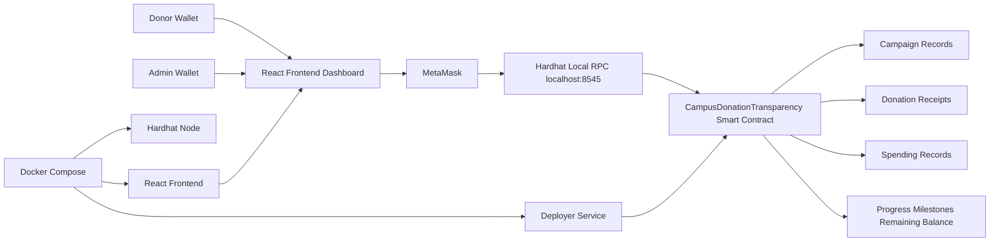
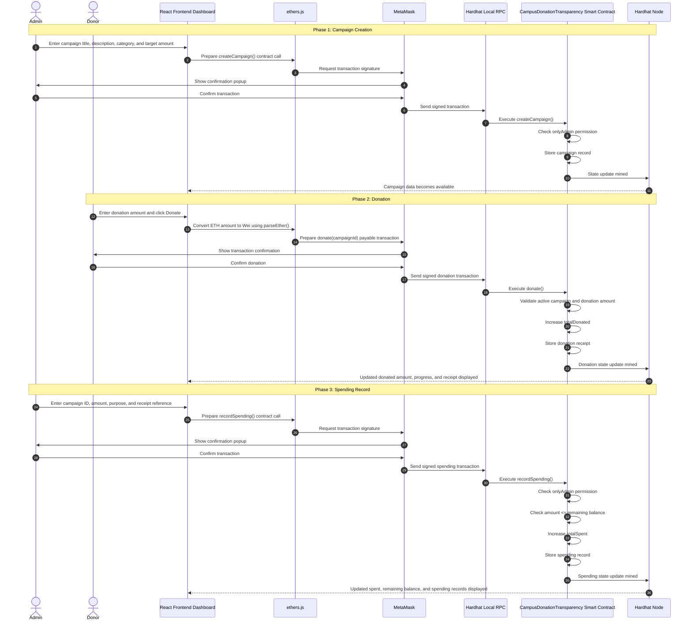

# Campus Donation Transparency App

A blockchain-based donation transparency dApp for tracking campus donations, donor receipts, spending records, remaining balances, and campaign progress using Solidity, Hardhat, React, ethers.js, MetaMask, and Docker.


---

## Overview

**Campus Donation Transparency App** is a blockchain-based web application designed to improve transparency and trust in campus donation campaigns.

The application allows donors to donate to specific campus causes such as library renovation, student aid, medical support, and technology support. Donations and spending records are stored through a Solidity smart contract on a local Hardhat blockchain, allowing users to verify how funds are collected and used.

The system includes a React dashboard that displays campaigns, donation progress, milestones, donor receipt history, admin spending records, platform statistics, and remaining balances.

---

## Problem Statement

Traditional campus donation systems usually depend on centralized records controlled by one organization or administrator. This can create trust issues because donors may not clearly know how their money is used after donation.

Common problems include:

- Donors cannot easily verify how funds are spent.
- Spending records may not be publicly visible.
- Donation receipts may be stored in private systems.
- Fund allocation may be unclear.
- Trust depends mainly on the organization instead of verifiable records.

This project addresses these issues by using blockchain as a transparent record system for donations and fund usage.

---

## Why Blockchain?

Blockchain is suitable for this project because donation systems require transparency, traceability, and trust.

In this project, blockchain is used to:

- Record every donation on-chain.
- Link each donation to a specific campaign and category.
- Allow donors to verify their own donation receipts.
- Record admin spending with a purpose and receipt reference.
- Show remaining campaign balances.
- Prevent spending more than the available campaign balance.
- Make donation and spending records difficult to manipulate after recording.

Blockchain is not used only as a payment tool here. It is used as a transparent and auditable record layer for campus donation management.

---

## Key Features

### Campaign Management

The admin can create donation campaigns. Each campaign includes:

- Campaign ID
- Title
- Description
- Category
- Target amount
- Total donated amount
- Total spent amount
- Active status
- Creation timestamp

### Category-Based Donations

Donations are linked to clear campus categories such as:

- Library
- Student Aid
- Medical Support
- Technology

### Donation Receipts

Every donation is recorded with:

- Donation ID
- Donor wallet address
- Campaign ID
- Category
- Donation amount
- Timestamp

### Spending Records

Only the admin can record spending. Each spending record includes:

- Spending ID
- Campaign ID
- Amount
- Purpose
- Receipt reference
- Timestamp

### Fund Traceability

The system shows the flow of funds:

```text
Donation received → Category allocation → Spending record → Remaining balance
```

### Overspending Prevention

The smart contract prevents the admin from recording spending greater than the available campaign balance.

### Donor View

A donor can connect MetaMask and view their personal donation receipt history.

### Admin Panel

The admin can:

- Create a new campaign.
- Record spending.
- View updated balances.
- Track campaign progress.
- Review spending records.

---

## Tech Stack

| Layer | Technology |
|---|---|
| Smart Contract | Solidity |
| Blockchain Development | Hardhat |
| Blockchain Interaction | ethers.js |
| Frontend | React + Vite |
| Wallet | MetaMask |
| Testing | Mocha + Chai |
| Containerization | Docker + Docker Compose |
| Local Blockchain | Hardhat Local Network |

---

## System Architecture



---

## Donation and Spending Lifecycle



---

## Smart Contract Summary

The main smart contract is:

```text
CampusDonationTransparency.sol
```

The contract manages:

- Campaign creation
- Donation recording
- Donor donation history
- Admin spending records
- Remaining balance calculation
- Campaign progress calculation
- Milestone tracking
- Platform statistics

Important functions include:

```text
createCampaign()
donate()
recordSpending()
getAllCampaigns()
getDonorDonations()
getCampaignSpendingRecords()
getCampaignRemainingBalance()
getCampaignProgress()
getMilestones()
getPlatformStats()
```

---

## Access Control

Only the admin wallet can:

- Create campaigns
- Record spending

This prevents unauthorized users from modifying financial records or adding spending entries.

---

## Project Structure

```text
campus-donation-transparency/
│
├── contracts/
│   └── CampusDonationTransparency.sol
│
├── scripts/
│   └── deploy.ts
│
├── test/
│   └── CampusDonationTransparency.ts
│
├── frontend/
│   ├── Dockerfile
│   ├── .dockerignore
│   ├── package.json
│   └── src/
│       ├── App.jsx
│       ├── App.css
│       ├── main.jsx
│       └── contract.js
│
├── deployments/
│   └── localhost.json
│
├── docker-compose.yml
├── hardhat.config.ts
├── package.json
├── PROJECT_REPORT.md
└── README.md
```

---

## Screenshots

### Dashboard Overview


### Campaign Cards and Progress


### Donation and Receipt Flow


### Admin Spending Panel


---

## Demo

The demo shows the main workflow of the application:

1. Opening the dashboard.
2. Viewing campaign statistics.
3. Connecting MetaMask.
4. Creating a campaign as admin.
5. Donating to a campaign.
6. Viewing donor receipt history.
7. Recording spending.
8. Viewing updated remaining balance and spending records.

![Demo Video]


---

## Manual Run Instructions

### 1. Install dependencies

From the project root:

```bash
npm install
```

### 2. Compile smart contracts

```bash
npx hardhat compile
```

### 3. Run tests

```bash
npx hardhat test
```

Expected result:

```text
9 passing
```

### 4. Start local Hardhat blockchain

Open a terminal from the project root and run:

```bash
npx hardhat node
```

Keep this terminal running.

### 5. Deploy the smart contract

Open another terminal from the project root and run:

```bash
npx hardhat run ./scripts/deploy.ts --network localhost
```

Expected result:

```text
Deployment completed successfully!
```

### 6. Run the frontend

Open another terminal:

```bash
cd frontend
npm install
npm run dev
```

Open the app:

```text
http://localhost:5173/
```

---

## Docker Run Instructions

The project supports Docker Compose.

### Run with Docker

From the project root:

```bash
docker compose up --build
```

Or, if the image is already built:

```bash
docker compose up
```

Docker Compose runs three services:

| Service | Purpose |
|---|---|
| chain | Runs the Hardhat local blockchain node |
| deployer | Deploys the smart contract and adds sample data |
| frontend | Runs the React dashboard |

Frontend URL:

```text
http://localhost:5173/
```

Local blockchain RPC:

```text
http://127.0.0.1:8545
```

### Stop Docker

```bash
docker compose down
```

---

## MetaMask Setup

To interact with the application, add the Hardhat local network to MetaMask:

```text
Network Name: Hardhat Local
RPC URL: http://127.0.0.1:8545
Chain ID: 31337
Currency Symbol: ETH
```

Use one of the local Hardhat test accounts printed in the terminal after running:

```bash
npx hardhat node
```

> Important: Hardhat accounts are for local testing only. Never use local testing private keys on a real blockchain network.

---

## Testing Summary

The project includes automated tests for:

1. Deploying with the correct admin
2. Creating campaigns
3. Making donations
4. Storing donor donation history
5. Recording spending by admin
6. Preventing non-admin spending
7. Preventing overspending
8. Calculating remaining balance
9. Calculating progress and milestones

Run tests:

```bash
npx hardhat test
```

Expected output:

```text
9 passing
```

---

## Limitations

This project is a local academic prototype and has some limitations:

- It runs on a local Hardhat blockchain.
- It does not use real money.
- It is not deployed to a public testnet.
- It does not store uploaded receipt images.
- It does not include advanced user authentication beyond wallet connection.
- It does not include real payment processing.
- It does not include advanced analytics charts.

---

## Future Improvements

Possible future improvements include:

- Deploying the project to a public Ethereum testnet.
- Adding IPFS storage for receipt images.
- Adding campaign images.
- Adding role-based admin management.
- Adding campaign closing logic.
- Adding refund logic.
- Adding donation and spending analytics charts.
- Adding public audit reports.
- Adding notifications when milestones are reached.

---

## What I Learned

Through this project, I practiced:

- Designing Solidity smart contracts
- Implementing access control in smart contracts
- Preventing overspending through contract validation
- Connecting React applications to blockchain using ethers.js
- Using MetaMask for wallet-based interaction
- Testing smart contracts with Hardhat, Mocha, and Chai
- Using Docker Compose to run a multi-service local blockchain application
- Thinking about transparency, traceability, and trust in decentralized applications

---

## Academic Context

This project was developed as part of the **Blockchain & Distributed Systems** coursework.

The goal was to demonstrate how blockchain can be used as a transparent and verifiable record system for donation tracking and fund usage.

---

## Conclusion

Campus Donation Transparency App demonstrates how blockchain can improve donation transparency in a campus environment.

By combining Solidity, Hardhat, ethers.js, React, MetaMask, and Docker, the project provides a complete blockchain prototype with donation traceability, donor records, spending transparency, campaign progress, milestones, and a clear user interface.
